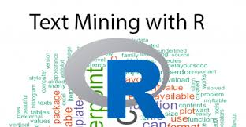

# Text Analysis {#TextMining .unnumbered}


```{r,  out.width='50%', fig.align='center', echo=FALSE}

```


To Be Added


## Most frequently used words {-}

## Emotion analysis by chapter {-}


## Section topics classification {-}


## Interactive search for answers to your question {-}

