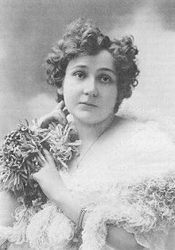
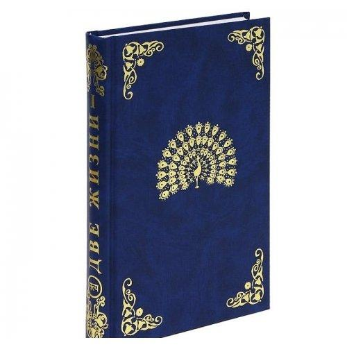

--- 
title: "«Two Lives» by Concordia Antarova"
subtitle: "Translation and analysis  of the sources"
#author: "Concordia Antarova"
# date: "DRAFT. Last updated: `r Sys.Date()`"
# date: "`r Sys.Date()`"
# date: "31/12/2017"
site: bookdown::bookdown_site
output: bookdown::gitbook
description: "«Two Lives» by Concordia Antarova: text translation and analysis"
url: 'http\://bookdown.org/gorodnichy/twolives-book'
cover-image: "book1.jpg"
---


# Introduction {-}


```{r,  out.width='33%', fig.align='center', echo=FALSE}
 
```


This work
presents the working draft of the English translation of 
the "The Lives" book by [Concordia  Antarova](https://en.wikipedia.org/wiki/Concordia_Antarova). 
Widely known in Russian speaking spheres, and   [translated into French](http://www.editions3m.com/livre.php?ID=23), this book remains to be largely unknown to English speaking population, despite its significant spiritual importance, comparable to that of ["Book of Joy"](http://bookofjoy.org/).


## Relevance to AI  {-}


While the efforts on translating this book into English continue,  here the draft of it is used for Artificial Intelligence (AI) projects, aiming at building the systems for automated analysis and translations of texts, using Deep Learning (a.k.a. [Artificial Neural Networks](https://github.com/gorodnichy/LA-R-KerasNN)) and [other text mining packages](https://github.com/gorodnichy/LA-R-text). 


The first Volume (of three) of the book is used. The original text in Russian and its English translation are provided. Text analysis results are provided at the end.

Other largely unknown to English public Russian texts of large spiritual significance include those  by [Nicholas Roerich](Nicholas Roerich) and [Helena Blavatsky](https://en.wikipedia.org/wiki/Helena_Blavatsky). The vision is that one day the language will not matter - people from all cultural backgrounds will be able to enjoy and learn from all  cultural heritage writings.


## Credits {-}

This work is done in support of the  [www.BookTwoLives.com](http://www.BookTwoLives.com) project. The project respects the intellectual property rights of all content creators. 


The processing of this text is done with 
 [R](https://www.rstudio.com/) and [bookdown](https://bookdown.org/). 
 The source is available at [github](https://github.com/gorodnichy/two-lives-book).


# “TWO LIVES” (Volume 1, Part 1) {-}


```{r,  out.width='50%', fig.align='center', echo=FALSE}

```


## About Concordia  Antarova {-}

Concordia Evgenievna Antarova was born in 1886 April 13 in Warsaw. She lost her father
when she was eleven years old, so then she was living with her mother. When she was fourteen years old,
being in the sixth grade of a secondary school, she also lost her mother, but she continued her studies and
finished the school. Having finished the school, she decided to enter a nunnery. She learned a lot while
being in it, and the church choir helped to develop her inborn musical talent. However, she was always
feeling that the life of the cloister was not for her. She met Saint John of Kronstadt, and he told her that she
was fated to work and live among other people.

She decided to go to St. Petersburg where she entered the faculty of history and philology
and graduated it in 1904. She was offered a job in the department of philology, but her dream was singing
and theatre. She decided to devote her life to the art. The lessons of singing were expensive, so she had to
work hard.

In 1907 from 160 candidates C. E. Antarova alone was accepted to the Mariinsky theatre
where her career as an artist began. In one year one of the actresses of the Bolshoi theatre of Moscow had
to move to St. Petesburg. C. E. Antarova was offered her place in Moscow. She moved to Moscow and at
once the entire complicated repertoire of contralto was offered to her: “Ruslan and Lyudmila”, “Eugene
Onegin”, “Sadko”, “Jolanta”, “Werther”, etc. She knew F. I. Chaliapin, S. V. Rachmaninoff and other famous
Russian intellectuals of that time. She was the student of K. S. Stanislavski in his studio of opera which later
developed into the Opera theatre of K. Stanislavski. Being fascinated by the personality of K. S. Stanislavski
and his artistic ideas, she wrote a book about him “Conversations with K. S. Stanislavski”.

C. E. Antarova was performing a lot with symphony orchestras. Her artistic and social
activities broke suddenly when she lost her husband in the Stalin’s Gulag.

She was dismissed from the theatre and in this way she lost all of her future. However, a
life’s chance saved her this time, too: Stalin didn’t like the voice of the singer who had replaced her, so C. E.
Antarova was returned to the Bolshoi theatre...

Concordia Antarova was living two lives of equal value: a creative life of an opera singer and
an inner spiritual one... Everyone who knew C. E. Antarova-singer knew almost nothing about her spiritual
path, and on the contrary, those who were naming her as their spiritual leader didn’t pay lots of their
attention to her theatrical creative activities. Her work “Two Lives” is dedicated namely to those disciples of
hers who were close to her in spirit. After her death in 1959 her closest disciples were left with four
handwritten copies of the novel.

The novel “Two Lives” first of all is an esoteric novel, revealing the esoteric knowledge which
is transmitted to the heroes of the novel by the Great Teachers of Mankind. C. E. Antarova herself had her
own Teacher and a connection to Shambhala.


## About “Two Lives” {-}

This novel will help everyone to reflect on his own place in today’s complicated life and his
relations to it. Great examples in this book reveal how people are boiling in their own passions, how they
are enslaved by them. Later the paths for the reader are revealed along which the Teachers of Life are
leading people from their passions to liberation, from weakness to fortitude, from fortitude to power, from
power to beauty...

Popularity of this novel written by C. E. Antarova was fated by the successful synthesis of
both Eastern and Western esoteric traditions.

We can find lots of information about these Teachers in the works by Helena and Nicholas
Roerich in which their cooperation with the Great Teachers is also reflected. The same Teachers were the
guardians of Helena Petrovna Blavatsky – the author of “The Secret Doctrine” and founder of the
Theosophical Society in 19th century.

The conception of integrity of the Universe, the principals of creative work of cosmic
evolution, creative work of man’s spirit as the most important factor of development of cosmic evolution
are revealed in “Two Lives”. The real time disappears in the novel, the historical personalities of various
epochs meet and cooperate here, because neither time nor space nor physical separation is existing for
man’s spirit...

